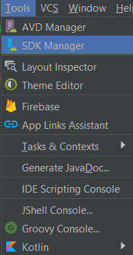

# Installation Procedure

## Android Studio - IDE

The current stable version of android studio can be downloaded from https://developer.android.com/studio/index.html . To download the installer, click on the "DOWNLOAD ANDROID STUDIO" button. 

When prompted, accept the terms and conditions of the installation and then click on the download button.

## Android Studio - SDK Setup

1. To setup all android SDK related content, First navigate to the "tools", located on the menu bar at the top of the android studio IDE.

2. After Expanding the tools, select "SDK Manager" from the drop down list. This will open a dialog which will let you configure your android SDK.

3. Make sure that once the android SDK is installed, the necessary platforms checked in the image below are installed on your device.It is not necessary to download all platforms but ensure that you download the platform that corresponds to your mobile phone or the phone you will be using to run the application.

4. To install android SDK or update it, click on the edit button as shown in the picture below to go to the android SDK setup dialog.

5. Once on the android SDK setup, choose the version of android SDK to download and the location on your device where you want to store the SDK. After this, click on "NEXT" to finsh the android SDK setup. 

6. After installation of the SDK, navigate back to the SDK manager dialog and select the SDK Tools. On this page, select the tools that are selected in the image below and click on apply/ok to install them. 

